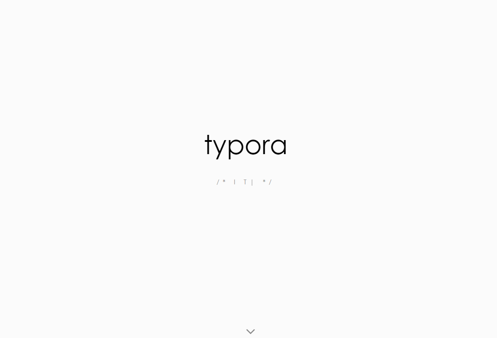
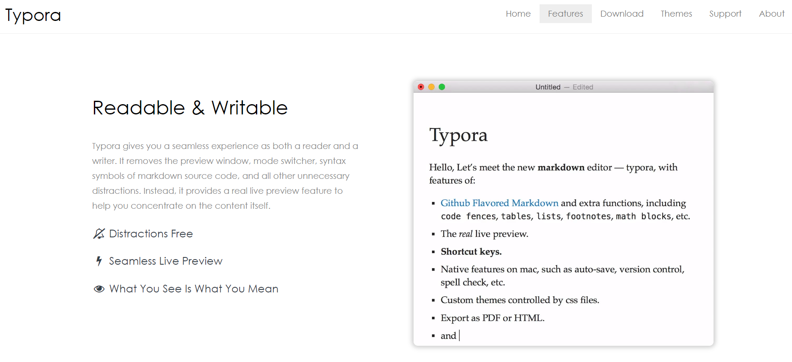
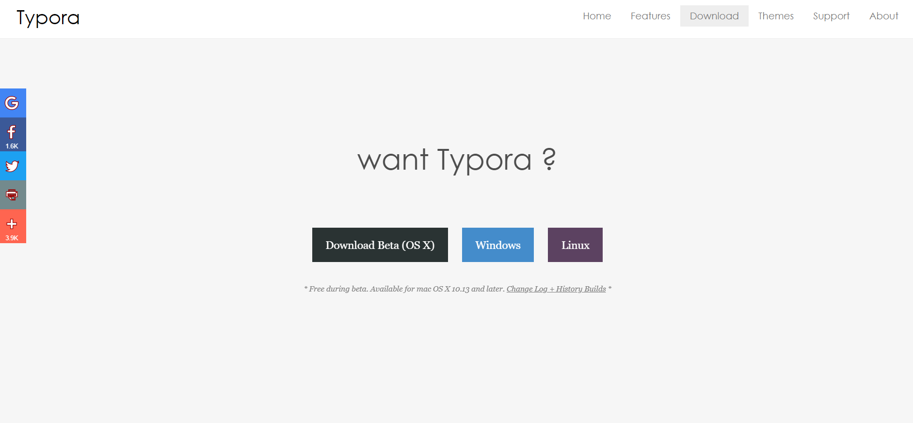
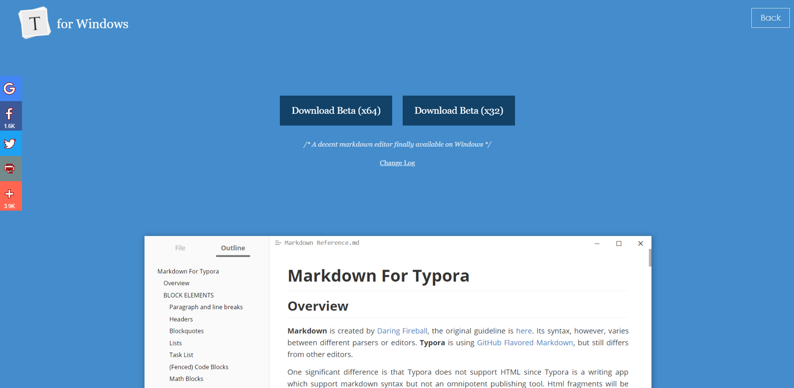

# Typora 설치하기

> '**Typora**'는 마크다운 에디터로 간단한 문서를 만들 수 있는 가볍고 편리한 무료 프로그램이다.
>
> '마크다운'이란 일반 텍스트 문서의 양식을 편집하는 문법을 말하며 마크다운을 이용해 만들어진 문서는 쉽게 다른 문서형태나 HTML로 변환이 가능하다.

## 1. [Typora 사이트](https://typora.io/) 접속

## 2. Download 클릭

## 3. 본인의 OS 선택

## 4. 운영체제(64bit/32bit) 선택하여 다운로드 

* 운영체제 사양은 **[파일 탐색기 - 내 PC - 마우스 오른쪽 클릭 - 속성]**에서 확인 가능

