# Git 설치하기

> Git은 분산형버전관리시스템(DVCS)이다.
>
> 깃의 핵심기능은 버전 관리(Version Control), 백업(Backup), 협업(Collaboration)이다.

## 1. [Git 사이트](https://git-scm.com/) 접속

* 오른쪽 하단의 Download ~를 클릭

* 다음 화면으로 이동하면서 자동으로 파일을 내려받기 시작한다.

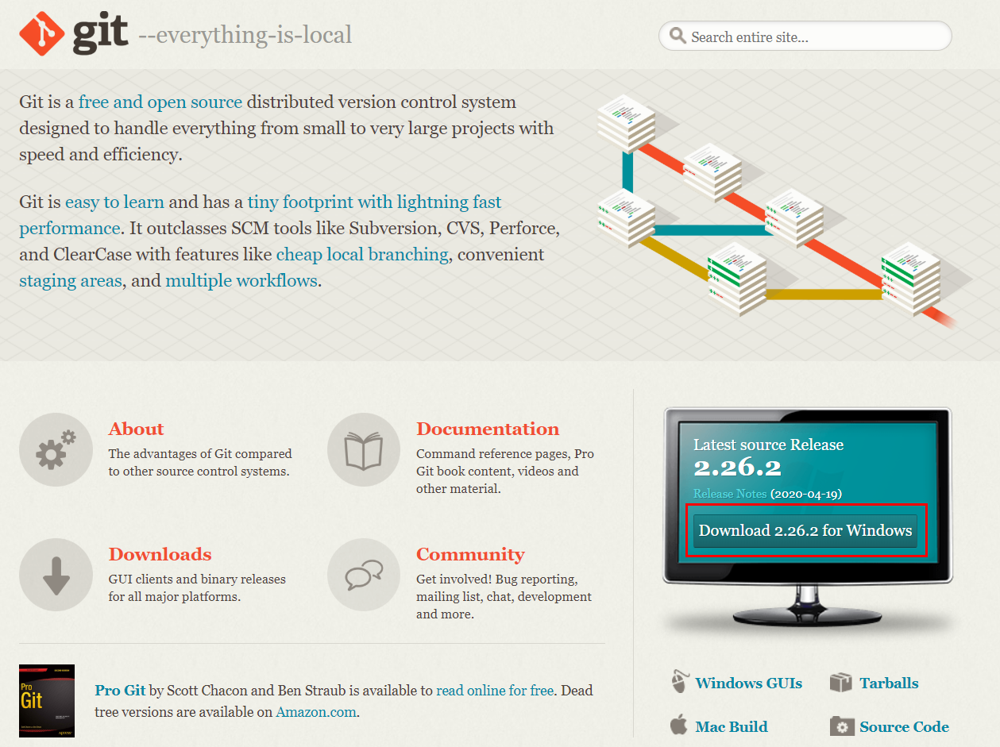

## 2. 설치 파일 실행

* 라이선스 정보를 확인하고 Next

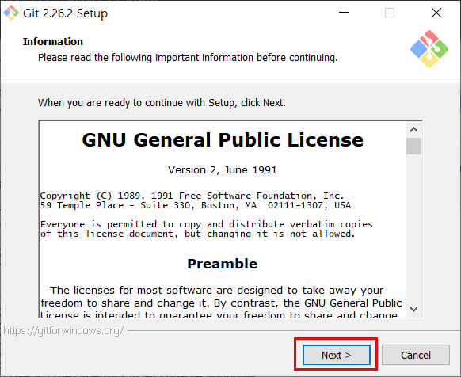

* 설치경로 확인 후 Next

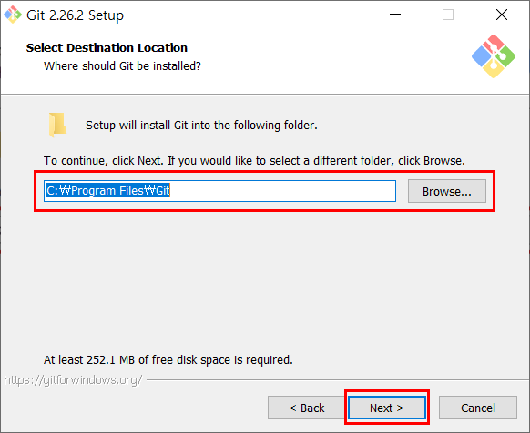

* 설치할 구성 요소 선택 후 Next
* 기본 값(default)으로 진행

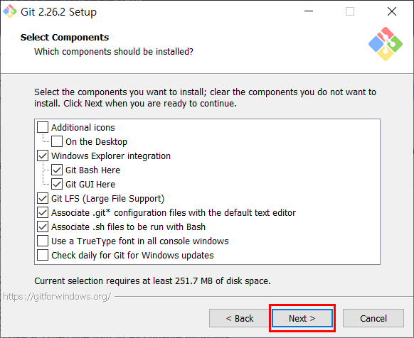

* 시작 메뉴에 폴더를 만들지 선택 후 Next

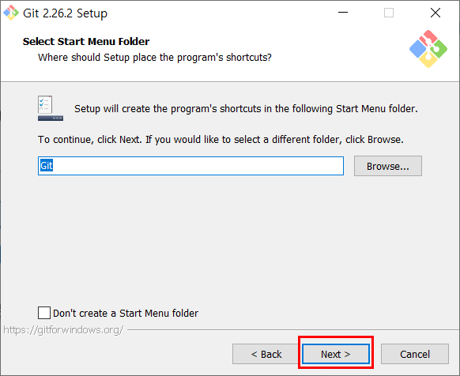

* 깃에서 사용할 기본 편집기(editor) 선택 후 Next
* 기본 값(default)으로 진행

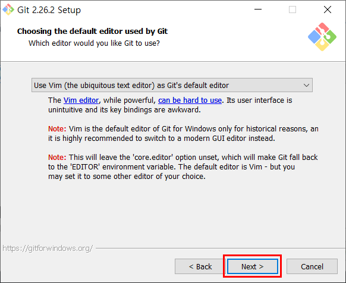

* 깃 커맨드(command) 설정 후 Next
* 기본 값(default)으로 진행

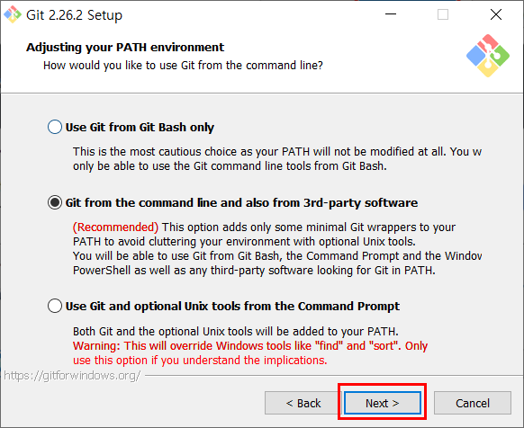

* 보안 서버에 접속하기 위한 방법 선택 후 Next
* 기본 값(default)으로 진행

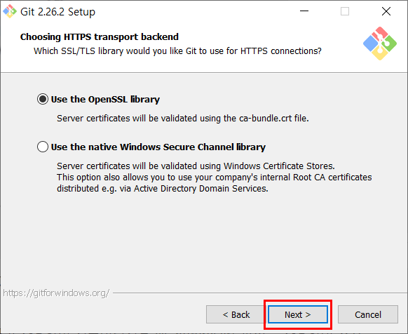

* 텍스트 줄 끝부분 설정 선택 후 Next
* 기본 값(default)으로 진행

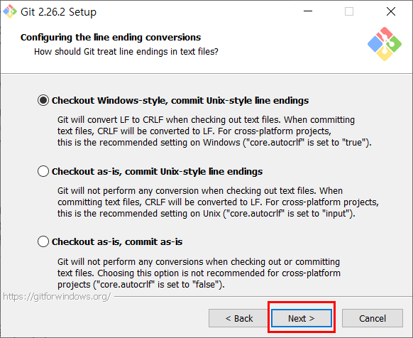

* 터미널 에뮬레이터 선택 후 Next
* 기본 값(default)로 진행

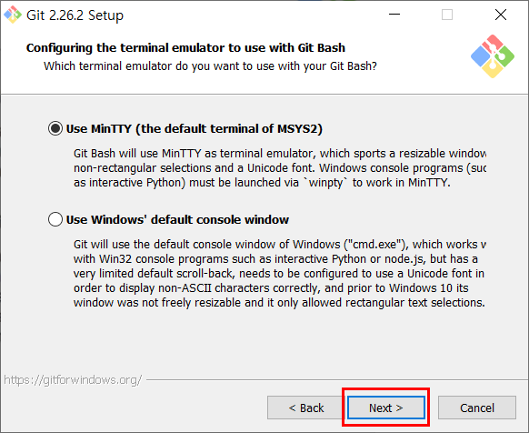

* 기타 옵션 선택 후 Install
* 기본 값(default)로 진행

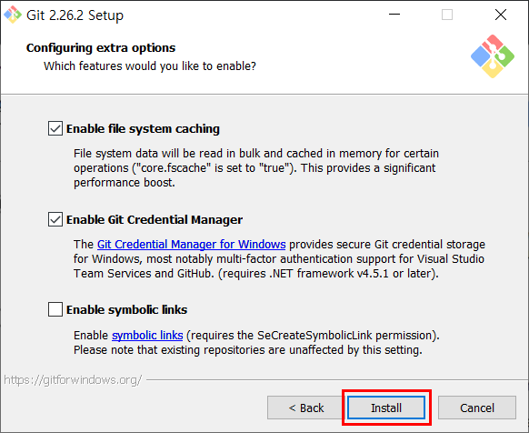

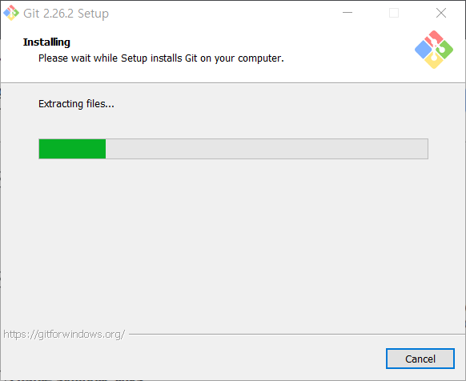

* 설치 완료

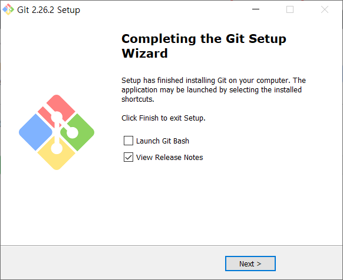

* 시작 메뉴에서 확인

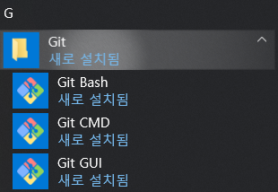

