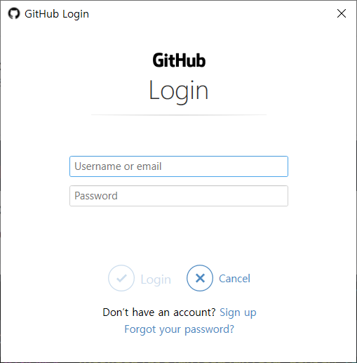
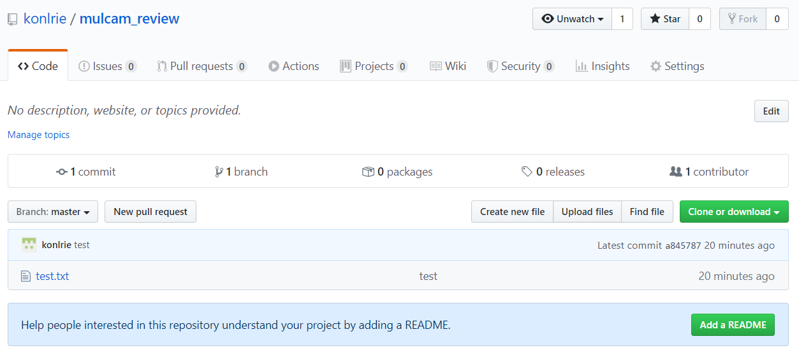

# Git 시작하기

## 0. 깃 환경 설정하기

* 깃을 사용하기 전에 사용자(author) 정보를 입력해야 한다.


* 아래의 명령어로 설정 내용을 확인한다.


## 1. New Repository


## 2. 깃을 사용할 폴더에서 git bash 실행


## 3. 깃 초기화하기(git init)


* `.git`이라는 숨김 폴더가 생성되며 모든 `git`과 관련된 동작은 해당 폴더에 기록된다.
  (**보기** - '숨긴 항목' 체크해서 확인 가능)
* git bash에서 `(master)` 라는 브랜치 정보가 표기된다.


## 4. 파일 생성

* test.txt 파일을 생성한다.


## 5. add

* `git`에서 커밋할 대상 파일을 `staging area` 로 이동시키는 명령어이다.

  ```
  $ git add test.txt --- 특정 파일을 stage
  $ git add image/   --- 특정 폴더를 stage
  $ git add .        --- 모든 파일 및 폴더 stage
  ```

  * add 전 상태

    

  * add 후 상태

    

## 6. commit

* git에서 이력을 남기기 위해서는 `commit`을 통해서 진행한다.

* `commit`을 남길 때에는 항상 커밋 메시지를 작성한다.

* 메시지는 해당 이력에 대한 정보를 담는다.

  

* 아래의 명령어로 커밋 이력을 확인한다.

  

  

> `add` : 커밋할 대상 파일 선정
>
> `commit` : 이력의 확정

## 7. 원격 저장소 연결하기

* 1번에서 저장소를 만들면 https 주소를 사용해 깃허브 저장소에 접속할 수 있다.

  

* 위의 내용 중에 '커맨드 라인에서 기존 저장소를 푸시하기' 방법을 사용할 수 있다.

  

  

* 아래의 명령어로 원격 저장소에 연결되었는지 확인한다.

  

## 8. push

* 원격 저장소에 업로드 하기 위해서는 `push` 명령어가 필요하다.

  

* 로그인 창이 나타나는 경우에는 로그인을 한다.

  


* github에 접속하여 확인한다.

  