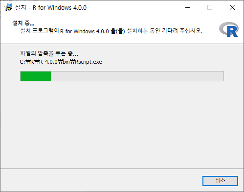

#  R 및 R Studio 설치하기

> **`'R'`**은 통계 분석에 특화된 언어이다.

# R

## 1. [R  공식 웹사이트](https://www.r-project.org/) 접속

* Download 항목의 CRAN 링크 클릭

* 스크롤을 내려 Korea를 찾아 링크 클릭(아무거나 상관 없음)

## 2. 본인의 OS 선택

* install R for the first time 링크 클릭

## 3. 설치 파일 다운로드

* Download R 4.0.0 for Windows 클릭

## 4. 설치 파일 실행

* 언어 선택 후 확인

* 내용 확인 후 다음

* 설치경로 확인 후 다음(경로에 공백이 포함되어 있기 때문에 다음과 같이 수정함)

* 필요한 항목 체크 후 다음(64bit이기 때문에 32bit 체크 해제 후 설치 진행함)
* 운영체제 사양은 **[파일 탐색기 - 내 PC - 마우스 오른쪽 클릭 - 속성]**에서 확인 가능

* 기본 값(default)으로 진행

* 설치 완료

# R Studio

## 1. [R Studio 공식 웹사이트](https://rstudio.com/) 접속

* Download 클릭

## 2. 데스크탑용 오픈 소스 라이선스 다운로드 클릭

## 3. 본인의 OS 선택하여 설치 파일 다운로드

## 4. 설치 파일 실행

* 설치경로 확인 후 다음(경로에 공백이 포함되어 있기 때문에 다음과 같이 수정함)

* 설치 진행

* 설치 완료

