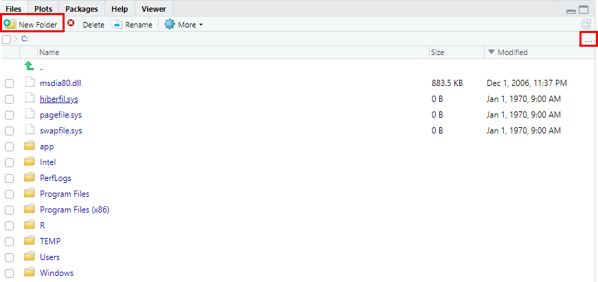
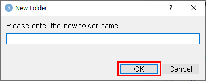
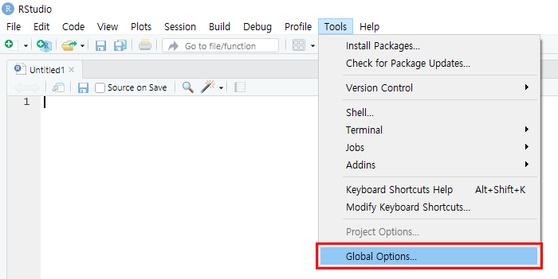
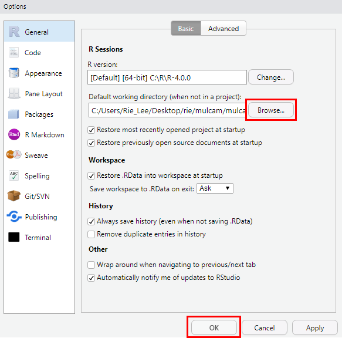
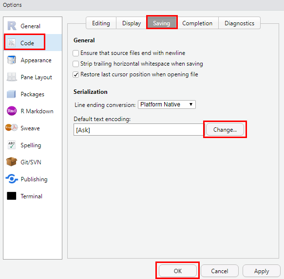
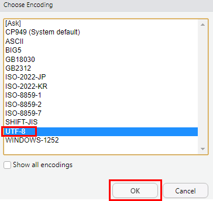

# R 시작하기

* R Studio를 실행시킨다.
* Files 창에서 오른쪽 위에 있는 [...] 버튼을 클릭하여 C:/ 경로를 선택한다.
  [New Folder] 버튼을 클릭하여 새로운 폴더를 추가한다.

* 폴더 이름을 입력하고 [OK] 버튼을 클릭한다.

* R Studio가 실행될 때 불러오는 폴더를 지정하고 싶다면 [Tools]의 [Global Options]의 [General]에서 불러올 파일을 선택해준다.

### +) 추가 설정

### UTF-8 설정

* [Tools]의 [Global Options]의 [Code]에서 Saving 탭을 클릭하고 Default text encoding의 Change를 클릭하여 UTF-8을 선택한다.

